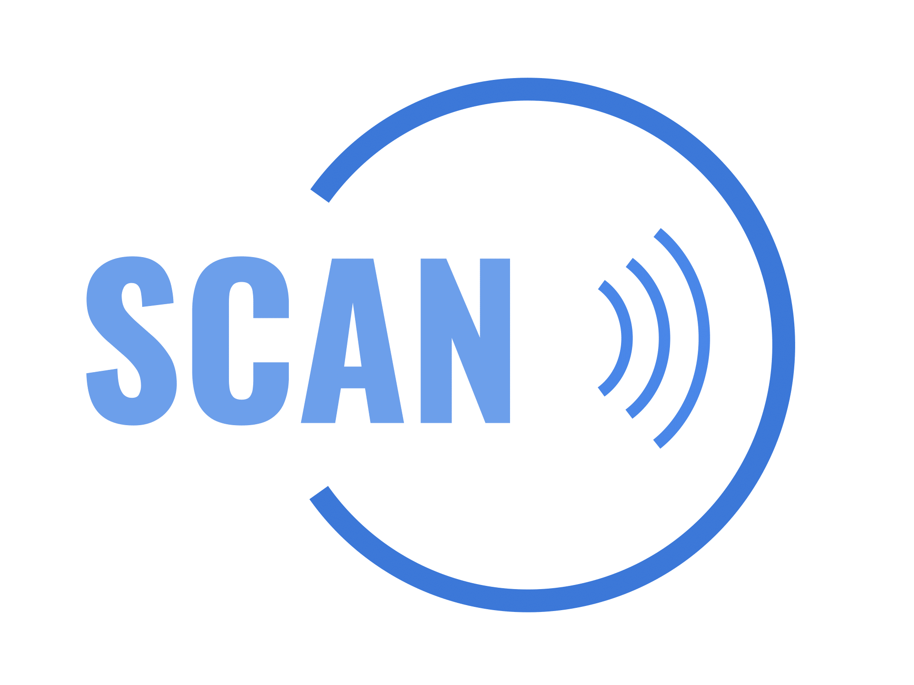

# 

Welcome to the **SCAN** repository! Below, you will find all the necessary information, from hardware design to software documentation.

---

## GitHub Workflows Status 🔧

Here are the current statuses of our GitHub workflows:

| Workflow Name            | Status                                  |
| ------------------------ | --------------------------------------- |
| **CI - Build**            |  |
| **Docker - Test Build**   |  |

- **CI - Build**: Ensures the project builds successfully.
- **CI - Tests**: Runs all unit and integration tests to ensure everything is working as expected.
- **Docker - Test Build**: Attempts Docker Build upon changes to the Dockerfile.

---

## Table of Contents 📚
- [💡 Overview](#overview)
- [🔧 Hardware Design](#hardware-design)
- [💻 Software](#software)
- [🔨 Build Instructions](#build-instructions)
- [📑 Documentation](#documentation)
- [⚙️ License](#license)

---

## 💡 Overview
 **SCAN** is a low-cost, IoT-driven kiosk system designed to provide real-time analytics based on check-in and check-out information. By integrating NFC-based authentication, real-time data processing, and a user-friendly interface, SCAN provides users with a near-effortless check-in experience and provides facilities with actionable insights for improving operations. SCAN is able to track attendance and provide detailed analytics on occupancy trends, peak usage hours, and visit durations. These insights are accessible to administrator and facility managers via SCAN’s web application, which can provide them with the necessary statistics to allocate resources efficiently, optimize staffing, and improve user experiences.

---

## 🔧 Hardware Design
<details>
  <summary><strong>📡 Schematic</strong></summary>

  Below is the schematic of the hardware design:

  
  
  **Key Features**:
  - Feature 1
  - Feature 2
  - Feature 3

  Additional hardware files can be found in the [hardware directory](hardware_design).

</details>

<details>
  <summary><strong>🔌 PCB Design</strong></summary>

  Here's the PCB design layout:

  

  **Important Notes**:
  - Note about the PCB.
  - Power considerations.
  - Any important design choices.

</details>

---

## 💻 Software
<details>
  <summary><strong>💾 Firmware Overview</strong></summary>

  The firmware is designed to work with the hardware for controlling the device. You can find the code [here](path/to/firmware).

  **Key Libraries Used**:
  - Library 1
  - Library 2

</details>

<details>
  <summary><strong>📦 Installation Guide</strong></summary>

  Follow these steps to install the firmware:
  
  1. Step 1
  2. Step 2
  3. Step 3

  Detailed instructions are available in the [installation guide](link_to_guide).

</details>

---

## 🔨 Build Instructions

<details>
  <summary><strong>🛠️ Build Setup</strong></summary>

  To build the project, follow these steps:

  1. Clone the repository:
     ```bash
     git clone https://github.com/jjsprandel/SCAN.git
     ```
  2. Connect your ESP32 to your computer using USB-C. The Docker container is designed to automatically recognize the device and use port 4000 to communicate to the ESP32 for flashing.
  3. Reopen Visual Studio Code in Container. This step requires having the Docker VS Code extension installed on your host machine. 
  4. Within the container, on first run, configure the ESP-IDF extension from the list of commands that come with the ESP-IDF extension.
     4a. Select "Use existing setup."
     4b. The extension should automatically find the right tool paths and folders. Select the configuration option with the auto-filled paths.
  5. Compile the firmware:
     ```bash
     idf.py build
     ```  
      5a. Alternatively, click the wrench button at the bottom of VS Code to build.
  6. Flash the firmware:
     ```bash
     idf.py --port 'rfc2217://host.docker.internal:4000?ign_set_control' flash
     ```
      6a. Alternatively, click the lightning button at the bottom of VS Code to flash.

  **Tips**:
  - Ensure your system meets the requirements listed in the [build prerequisites](link_to_prerequisites).
  - If you encounter issues, check the [troubleshooting guide](link_to_troubleshooting).

</details>

---

## 📑 Documentation
<details>
  <summary><strong>📝 API Documentation</strong></summary>

  - **[API Reference](link_to_api_reference)**: Detailed API usage and function descriptions.
  - **[Hardware Docs](link_to_hardware_docs)**: Documentation on hardware design.

</details>

<details>
  <summary><strong>📚 Additional Resources</strong></summary>

  - **[Project Wiki](link_to_wiki)**: Explore the project wiki for more in-depth articles.
  - **[User Manual](link_to_user_manual)**: Comprehensive user guide for operation.

</details>

---

## 🔌 Dependencies

This project has the following dependencies that need to be installed:

### **Hardware Dependencies:**
- **KiCad Version**: 8.0.6 (required for schematic and PCB design)
  - Download from [KiCad official website](https://kicad.org/download/).
  
### **Software Dependencies:**
- **USB Drivers**: For proper communication with the hardware, ensure that the appropriate USB drivers are installed.
  - For Windows, you can download and install the **[CP210x USB to UART Bridge VCP drivers](https://www.silabs.com/developer-tools/usb-to-uart-bridge-vcp-drivers?tab=downloads)**.
  - For Linux, you should have the necessary drivers already built into the kernel, but check the [driver documentation](https://www.silabs.com/community/interface/usb-bridges) for troubleshooting.

- **Docker Desktop**: Required to run the ESP-IDF containerized environment.
  - Download from **[Docker Desktop website](https://www.docker.com/products/docker-desktop)**.
  - Follow the installation instructions for your operating system.
  
### **Development Tools:**
- **[Visual Studio Code](https://code.visualstudio.com/)**: Recommended IDE for editing the firmware code.

- **[Git](https://git-scm.com/)**: Version control system.

---

## ⚙️ License
SCAN © 2025 is licensed under Creative Commons Attribution-NonCommercial-NoDerivatives 4.0 International. To view a copy of this license, visit https://creativecommons.org/licenses/by-nc-nd/4.0/ or see the [LICENSE](LICENSE) file.

